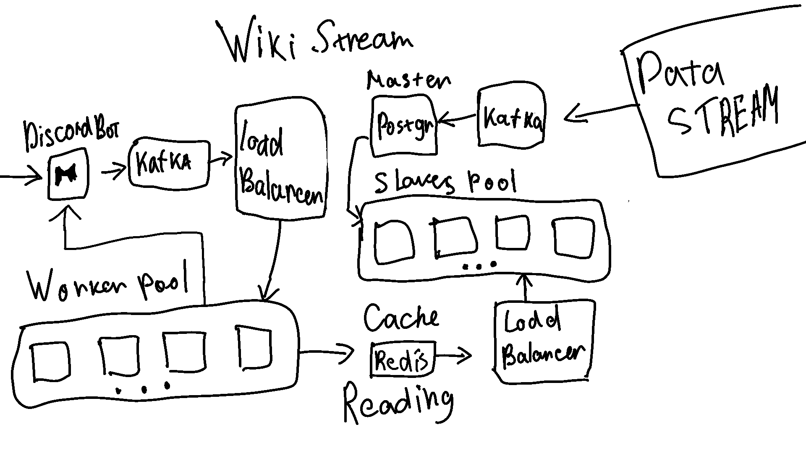

<div align="center">
  
  
  # WikiStream
  
  *Discover recent Wikipedia changes in real-time*
</div>

## Installation

Copy repo:
```bash
git clone https://github.com/imNauryzbay/wikistream
```

## Run

Open cloned repo:
```bash
cd wikistream/cmd
```

Take token from Discord:
```bash
go run main.go -token TOKEN
```

## Usage

After running the bot, two commands are available:

- `!recent`: Shows up to 5 last changes (waits 5 seconds)
- `!setLang`: Change language (default: en)
  - Example: `!setLang ru`


## Scaling  

  

So, for this task, the vulnerability is to read from the database and quickly populate the database from the stream.  

Moving on to systems design, I will describe the sequence of how I would scale this and describe two options: **budget** and **more conservative**.  

If I were to store data and then return by a specific date, I would choose **PostgreSQL**, relational, although **MongoDB** is also scalable. Just because of the structure of the data.  

1. I would separate the **master** and **slave** databases.  
2. Processing of queries coming from the bot and replenishment of the master database requires a **buffer**. I think I would put there **message broker Kafka**, as it stores everything on **disk space**, not in RAM. The delay will naturally be longer, but it will be more reliable.  
3. I would put **caches** to the database.  

Now let's talk about **horizontal scaling****, and more specifically, what would constitute **scalability**. 

- So first of all, we have **slave databases**, each of them has limitations, let's create a **pool of slave databases**.  
- The second is on the side of the **bot request handlers**. Here, after the queue of messages, we put a **balancer**. The balancer will distribute **Pods** that will take pieces of messages and **parallel processing** (read and return). There will definitely be a connection between these handlers and the **pool of slave databases**.  

So we have **only two pools**:  
1. **Slave databases**  
2. **Handlers**  

Let's move away from the fact that we have a **master node**, and we will just automatically **scale replicas replenishing the pool if it is AWS**.  

However, if we have a **dedicated server**, then we can negotiate with our provider to **automatically provide more resources for our Pod replicas**. Otherwise, we can rent servers and connect them to a **master node**, and fill Pods with replicas on these nodes. But in this case, if it is not within the network of one provider, the **latency will be higher**.  
